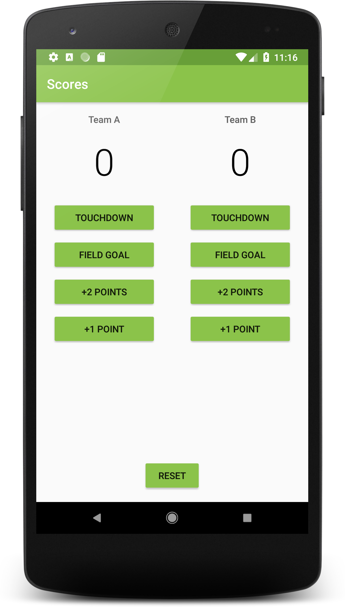

# Android Basics Nanodegree by Google | Udacity Project 2: Score Keeper App
A simple app to track scores between two teams playing american football. The app also contains a reset button that resets the scores for both teams.

